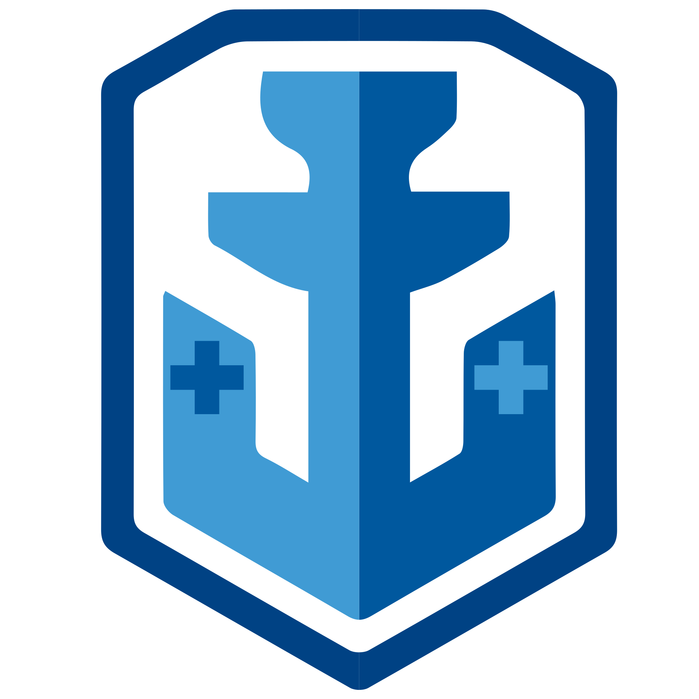

<link rel="preconnect" href="https://fonts.googleapis.com">
<link rel="preconnect" href="https://fonts.gstatic.com" crossorigin>
<link href="https://fonts.googleapis.com/css2?family=Montserrat:wght@500&display=swap" rel="stylesheet">

<div style="font-family: 'Montserrat', sans-serif;">

<div align="center"> 
    
    <h1 style="top: -2ch">Морський Бій</h1>
</div>


- **Назва**: Морський бій
- **Жанр**: Стратегія
- **Мова інтерфейсу**: Українська
- **Автор**: Vraschak Dmytro <a href="https://www.instagram.com/dmitriydoker/">dmitriydoker</a>

> Консольна гра написана на мові програмування С++ та розрахована на одного гравця (Single Player)


<hr style="height: 7px;">


<h2>Правила гри</h2>
<b>«Морський бій»</b> — гра для двох учасників, у якій гравці по черзі називають координати на невідомій їм карті суперника.
Якщо у суперника в тому місці є корабель (координати зайняті), то корабель або його частина «тоне», а той, хто влучив, здобуває право зробити ще один хід.
*Мета гравця* — першим потопити всі кораблі супротивника.


<h2>Розміщення кораблів</h2>
<div>

**Ігрове поле** — квадрат 10 × 10 кожного гравця, на якому розміщений флот кораблів.

Горизонталі зазвичай нумерують зверху вниз, а вертикалі позначають буквами зліва направо.


</div>

**Загалом є десять кораблів:**

- 1 корабель — ряд із 4 клітин («чотирипалубний»)
- 2 кораблі — ряд із 3 клітин («трипалубні»)
- 3 кораблі — ряд із 2 клітин («двопалубні»)
- 4 кораблі — 1 клітина («однопалубні»)


> При розміщенні кораблі не можуть торкатися один одного, між ними повинен бути проміжок не менше 1 клітинки.


<h2>Пошук і потоплення кораблів супротивника</h2>
Гравець, який виконує хід, вибирає координати клітинки, в якій, на його думку, перебуває корабель суперника і здійснює постріл.

1. Якщо гравець влучає в клітинку, в  якій не знаходиться жоден корабель, то місце пострілу позначається порожнім і право ходу переходить до суперника.
2. Якщо постріл влучив у клітину, де розташований корабель, клітинка позначається підбитою. Гравець, який стріляв, дістає право на ще один постріл.


> Гравці не можуть стріляти в клітинку по якій вже здійснювався потсріл.

Переможцем є той, хто першим потопив усі 10 кораблів противника.


<hr style="height: 7px;">


<h2>Фунціонал проекту</h2>

- Система акаунтів
- Перегляд статистики для кожного гравця
- 2 режима гри
  - Гравець проти бота
  - Бот проти бота (демонстрація)
- 2 способи розстановки кораблів
  - Ручна розстановка
  - Автоматична розстановка
-  Штучний інтелект
- Збереження гри та можливість продовжити її в будь-який момент
> Збереження створюються окремо для кожного акаунту (ви не можете дограти чужу партію).


<hr style="height: 7px;">


<h2>Цікаві фрагменти коду</h2>

<h3>Функція перевірки корабля на потоплення:</h3>

- Перевірка чи корабель потонув

```
bool isDrown(int x, int y, int field[10][10]) {
	int dir = findDirection(x, y, field);

	if (dir == FOUND_ALIVE) return false; 

	if (dir == DROWN_ALREADY) {
		makeDrown(x, y, field, dir);
		return true;
	}

	bool drown = checkOnDirection(x, y, field, dir) and checkOnDirection(x, y, field, inverseDir(dir));

	if (drown) makeDrown(x, y, field, dir);	

	return drown;
}
```

- Пошук напрямку в якому простягається корабель

```
int findDirection(int x, int y, int field[10][10]) {
	int dirX = NO_DIRECTION, dirY = NO_DIRECTION;

	for (int  xx = x - 1; xx <= x + 1; xx++) {
		for (int yy = y - 1; yy <= y + 1; yy++) {
			if (!inField(xx) or !inField(yy))  continue; 

			if (field[xx][yy] == ALIVE)  return FOUND_ALIVE; 

			if (field[xx][yy] == DAMAGED) {
				if (xx != x or yy != y) {
					dirX = xx;
					dirY = yy;
				} 
			}
		}
	}
	if (dirX == NO_DIRECTION and dirY == NO_DIRECTION)  return DROWN_ALREADY; 

	if (dirX > x)  return RIGHT; 
	if (dirX < x)  return LEFT;
	if (dirY > y)  return DOWN; 
	if (dirY < y)  return UP; 
}
```

- Перевіряє корабель вздовж на наявність живих палуб

```
bool checkOnDirection(int x, int y, int field[10][10], int dir) {
	while (true) {
		if (!inField(x) or !inField(y))  return true;

		if (field[x][y] == EMPTY or field[x][y] == DUMMY)  return true;

		if (field[x][y] == ALIVE)  return false;

		processOnDirection(x, y, dir); // обробляє координати (х, у) в залежності від напрямку
	}
}
```
</div>
