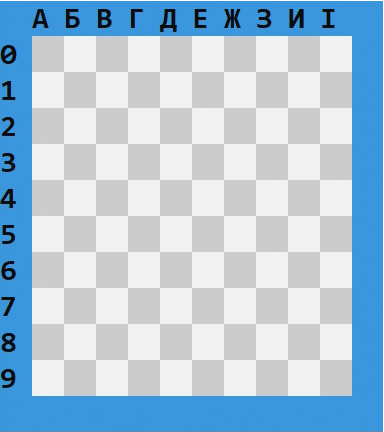

# Гра "Морський Бій"

- **Назва**: Морський бій
- **Жанр**: Стратегія
- **Мова інтерфейсу**: Українська
- **Автор**: Vraschak Dmytro 

> Консольна гра написана мовою програмування С++ та розрахована на одного гравця (Single Player)


<hr style="height: 7px;">


## Правила гри
**«Морський бій»** — гра для двох учасників, у якій гравці по черзі називають координати на невідомій їм карті суперника.
Якщо у суперника в тому місці є корабель (координати зайняті), то корабель або його частина «тоне», а той, хто влучив, здобуває право зробити ще один хід.

Мета гравця — першим потопити всі кораблі супротивника.

## Розміщення кораблів
**Ігрове поле** — квадрат 10 × 10 кожного гравця, на якому розміщений флот кораблів.

Горизонталі зазвичай нумерують зверху вниз, а вертикалі позначають буквами зліва направо.



**Загалом є десять кораблів:**

- 1 корабель — ряд із 4 клітин («чотирипалубний»)
- 2 кораблі — ряд із 3 клітин («трипалубні»)
- 3 кораблі — ряд із 2 клітин («двопалубні»)
- 4 кораблі — 1 клітина («однопалубні»)


> При розміщенні кораблі не можуть торкатися один одного, між ними повинен бути проміжок не менше 1 клітинки.

## Пошук і потоплення кораблів супротивника
Гравець, який виконує хід, вибирає координати клітинки, в якій, на його думку, перебуває корабель суперника і здійснює постріл.
1. Якщо гравець влучає в клітинку, в якій не знаходиться жоден корабель, то місце пострілу позначається порожнім і право ходу переходить до суперника.
2. Якщо постріл влучив у клітину, де розташований корабель, клітинка позначається підбитою. Гравець, який стріляв, дістає право на ще один постріл.


> Гравці не можуть стріляти в клітинку по якій вже здійснювався постріл.
> 
Переможцем є той, хто першим потопив усі 10 кораблів противника.


<hr style="height: 7px;">


## Функціонал проекту

- Система облікових записів
- Перегляд статистики для кожного гравця
- Режим гри "Гравець проти бота"
- Режим демонстрація (Бот проти бота)  
- 2 способи розташування кораблів
  - Ручне розташування
  - Автоматичне розташування
-  Штучний інтелект
- Збереження гри та можливість продовжити її в будь-який момент
> Збереження створюються окремо для кожного акаунту (ви не можете дограти чужу партію).


<hr style="height: 7px;">


## Головне з коду
### Ігрове поле
Ігрове поле описане як двумірний масив 10х10 і містить в собі значення всіх клітинок.
```c++
int Field[10][10];
```
Клітинки можуть мати різні значення, які описані в enum:
```c++
enum CellStatus {
    EMPTY = 0, ALIVE = 1
};
```
Під час гри вони також можуть змінювати своє значення в залежності від того,
куди здійснюється постріл:
```c++
enum CellStatus {  
    DAMAGED = 2, DROWN = 3, DUMMY = 4
};
```
### Розташування кораблів
У гравця є два способи розташування кораблів:

**Автоматично**
```c++
void autoPosition(int field[MAP_SIZE][MAP_SIZE]) {
	int ships[] = { 4, 3, 3, 2, 2, 2, 1, 1, 1, 1 };
	int x, y, ship_len;
	bool rotated;

	for (size_t i = 0; i < SHIP_AMOUNT; i++) {
		do {
			x = getRandCoord();
			y = getRandCoord();
			rotated = getRandBool();
			ship_len = ships[i];
		} while (!applyPosition(field, ship_len, x, y, rotated));
	}
}
```
Функція **autoPosition()** запускає цикл for який повторюється стільки 
разів, скільки є кораблів у грі.

Для кожного корабля по черзі знаходяться:
- Координати (х, у)
- Положення (горизонтально чи вертикально)
- Довжина (береться по черзі з масиву ships[])

Ці дії повторюються циклом while до тих пір поки функція **applyPosition()**
не підтвердить що даний корабель можна поставити в дані координати.

**Вручну**
```c++
void manualPosition() {
	int ships[] = { 4, 3, 3, 2, 2, 2, 1, 1, 1, 1 };
	int activeShip;
	
	while (canChoose(ships)) {
		activeShip  = chooseShip(ships);
		setShip(activeShip, ships);
	}
}
```
Функція **manualPosition()** запускає цикл while який повторюється до тих пір,
поки є доступні кораблі які гравець може розставити, що перевіряється функцією **canChoose()**.

Змінна **activeShip** приймає значення корабля який вибрав гравець у функції **chooseShip()**.

Після цього гравець розташовує вибраний корабель на полі за допомогою функції **setShip()**.

### Переміщення 
Переміщення в програмі здійснюється функцією **getKey()**, яка може трохи змінюватись
в різних ділянках коду для різних потреб

Головна функція **getKey()** виглядає так:
```c++
void getKey(int x, int y, bool& move) {
    int key;
    key = _getch();
    
    switch(key) {
        case ENTER:
            move = false;
            break;
        case UP_ARROW:
            y--;
            break;
        case DOWN_ARROW:
            y++;
            break;
        case LEFT_ARROW:
            x--;
            break;
        case RIGHT_ARROW:
            x++;
            break;
        default:
            break;
    }
}
```
Значення клавіш також описані в enum:
```c++
enum Keys {
    ENTER = 13,
    UP_ARROW = 72, DOWN_ARROW = 80, 
    LEFT_ARROW = 75, RIGHT_ARROW = 77
};
```

### Штучний інтелект
Штучний інтелект в проекті може виконувати функцію "добивання" після того, 
як знайде живий корабель

Для цього використовується структура АІ в якій об'явлено декілька змінних:
```c++
struct AI {
	bool hit = false;
	int startX;
	int startY;

	int hitX;
	int hitY;

	bool found_dir = false;
	int direction;
};
```
Булеві змінні:
- hit - зберігає дані про те, чи знайшов бот корабель, який потрібно добити
- found_dir - зберігає дані про те, чи знайшов бот "правильний" напрямок в якому
простягається недобитий корабель

Змінні int:
- startX та startY - координати першого попадання по кораблю
- hitX та hitY - координати останнього пострілу по кораблю
- direction - напрямок в якому простягається корабель

Всі напрямки описані в enum:
```c++
enum Directions {
    NO_DIRECTION = 0,
    UP = 1, DOWN = 2, 
    LEFT = 3, RIGHT = 4
};
```

**Головна функція штучного інтелекту:**

Функція **bot_shot()** запускає цикл while який повторюється до тих пір,
поки право ходу належить боту(див. [Пошук і потоплення кораблів супротивника](#Пошук-і-потоплення-кораблів-супротивника))
```c++
void bot_shot(AI &bot_AI, int enemy_field[10][10]) {
	int x, y, direction;
	bool run = true;

	do {
		fillAI(bot_AI, x, y, direction, enemy_field);
		setupShot(enemy_field, x, y, direction, bot_AI); 
		run = processShot(bot_AI, enemy_field, x, y, direction);
	} while (run);
}
```
Кожну ітерацію циклу виконуються три функції:

Функція **fillAI()** - заповнює змінні(x, y, direction (рядок №2)) зі структури **bot_AI**.
Якщо даних про корабель немає, тоді шукає рандомні координати для пострілу.

Функція **setupShot()** - "готує" координати для пострілу, змінюючи їх в залежності від 
відомих даних про корабель(останній постріл по кораблю, напрямок в якому розташований корабель).
Якщо таких даних немає, тоді бот робить постріл по рандомним координатам знайденим у функції вище.

Функція **processShot()** - обробляє дані про виконаний постріл, змінює статус клітинки на полі та вносить
коригування в структуру **bot_AI**, якщо потрібно.